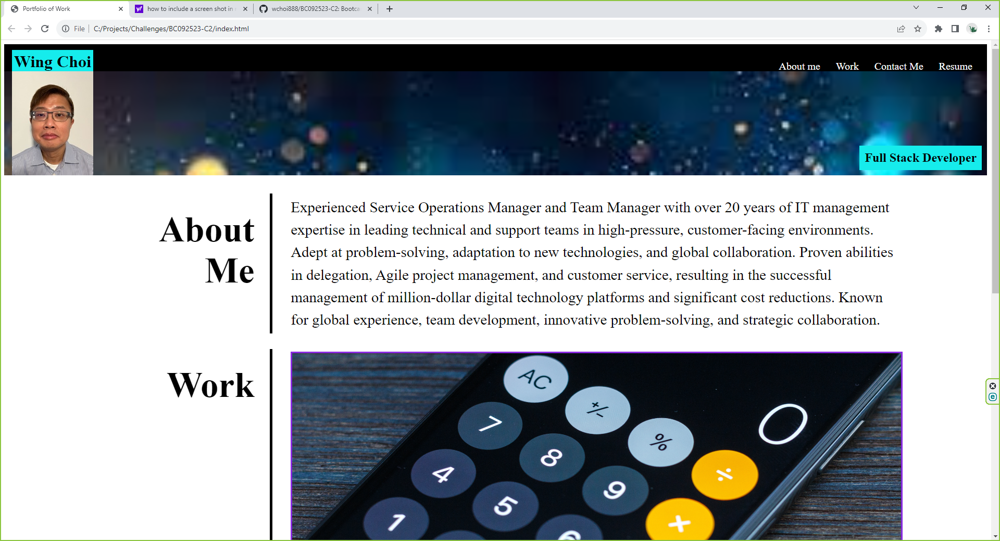
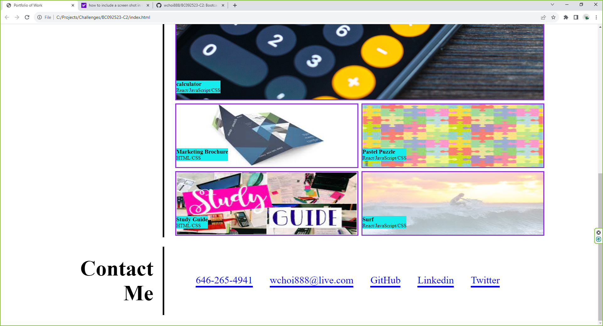

# Portfolio of Work for Prospective Employers

This webpage has been meticulously designed to serve as a comprehensive portfolio, intended to captivate prospective employers. It features an array of meticulously crafted sample applications, effectively demonstrating my proficiency in web development. Within this digital exhibit, you will find not only a recent photograph of myself but also seamless navigation to dedicated sections, encompassing insights into my background, a showcase of my professional work, and convenient avenues for contacting me, including connections via prominent social media platforms such as LinkedIn and Twitter.

## Installation

N/A

## Usage

Navigating through this Portfolio Webpage is user-friendly. You can start by clicking on the "About Me" link to learn about my background, skills, and professional journey. The "Work" section houses a carefully curated selection of sample applications I've developed, offering a glimpse into my web development expertise. To connect with me, head over to the "Contact Me" section, where you'll find various means of communication, including phone, email, GitHub, LinkedIn, and Twitter. If you're interested in delving deeper into my qualifications, the "Resume" link provides access to my detailed resume. When you resize the page or view the site on various screens and devices, you will be
presented with a responsive layout that adapts to your viewport. This Portfolio Webpage is thoughtfully structured to help you explore my skills, work, and facilitate communication.

## Credits

N/A

## License

Please refer to the LICENSE in the repo.

## Limitations

1. The only sample applications that can be showcased at this point are the CSS/HTML applications: Study Guide and Marketing Brochure. The other applications that require other technologies like JavaScript and React ARE NOT YET covered in Bootcamp and I used image files as placeholder for the portfolio in the meantime.
2. I am not an active Twitter/X user. The Twitter link will only bring up a generic Twitter/X page.
3. Not all unit of measurement is standardized in px or em. There were quite a bit of trial-and-error in trying to get the images to line up properly and spacing to be correct.

## Screen Shot

